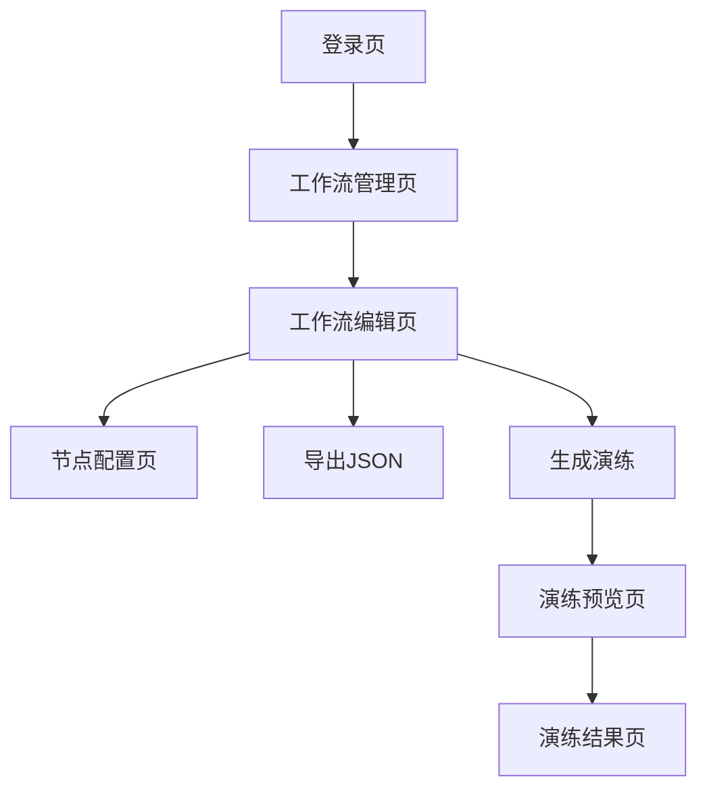

## 1. 产品概述
医药代表情景演练系统是一个面向药企的Web端工作流编辑器，帮助培训经理创建标准化的医药代表拜访流程。通过可视化拖拽画布，快速构建包含开场、信息传递、异议处理、合规检测等节点的培训场景，并生成可交互的H5预览页面供医药代表练习使用。

## 2. 核心功能

### 2.1 用户角色
| 角色 | 注册方式 | 核心权限 |
|------|----------|----------|
| 培训经理 | 企业邮箱注册 | 创建工作流、编辑节点、配置AI角色、导出JSON、生成演练 |
| 医药代表 | 企业邀请码 | 查看演练场景、参与对话练习、查看演练结果 |

### 2.2 功能模块
系统包含以下核心页面：
1. **工作流编辑页**：可视化拖拽画布、节点类型库、节点配置面板、工具栏
2. **节点配置页**：AI角色设置、节点属性编辑、预览配置
3. **演练预览页**：对话交互界面、场景切换、演练结果展示
4. **工作流管理页**：模板列表、搜索筛选、导出导入功能

### 2.3 页面详情
| 页面名称 | 模块名称 | 功能描述 |
|----------|----------|----------|
| 工作流编辑页 | 拖拽画布 | 支持节点拖拽、连接、删除，画布缩放和平移 |
| 工作流编辑页 | 节点类型库 | 提供开场、信息传递、异议处理、合规检测四种节点类型 |
| 工作流编辑页 | 工具栏 | 保存工作流、导出JSON、生成演练、撤销重做 |
| 节点配置页 | AI角色配置 | 设置医生角色特征（严肃主任、友好医生等） |
| 节点配置页 | 节点属性 | 编辑节点标题、内容、提示词、跳转逻辑 |
| 演练预览页 | 对话界面 | 显示当前场景对话内容，支持用户输入和选择 |
| 演练预览页 | 场景切换 | 根据用户选择自动跳转到下一个节点 |
| 工作流管理页 | 模板列表 | 展示所有保存的工作流模板 |
| 工作流管理页 | 导出导入 | 支持JSON格式的工作流导出和导入 |

## 3. 核心流程
培训经理操作流程：
1. 登录系统进入工作流编辑页
2. 从节点类型库拖拽节点到画布
3. 连接节点形成完整流程
4. 双击节点配置AI角色和属性
5. 保存工作流并导出JSON
6. 点击生成演练创建H5预览

医药代表操作流程：
1. 通过邀请码进入演练预览
2. 根据场景提示进行对话选择
3. 系统自动跳转到对应节点
4. 完成演练后查看结果反馈

## 4. 用户界面设计

### 4.1 设计风格
- **主色调**：医疗蓝（#1890FF）+ 专业灰（#F5F5F5）
- **按钮样式**：圆角矩形，悬停效果，主要操作用蓝色
- **字体**：系统默认字体，标题16px，正文14px
- **布局风格**：左侧节点库，中央画布，右侧属性面板
- **图标风格**：简洁线性图标，符合医疗行业调性

### 4.2 页面设计概览
| 页面名称 | 模块名称 | UI元素 |
|----------|----------|--------|
| 工作流编辑页 | 左侧节点库 | 垂直卡片式布局，每个节点类型有图标和名称 |
| 工作流编辑页 | 中央画布 | 网格背景，节点显示为彩色卡片，连接线用箭头 |
| 工作流编辑页 | 右侧属性 | 表单输入框，下拉选择器，保存按钮 |
| 节点配置页 | AI角色设置 | 角色头像选择器，性格描述文本框 |
| 演练预览页 | 对话界面 | 聊天气泡样式，用户选择按钮组 |

### 4.3 响应式设计
- **桌面端优先**：主要面向培训经理使用
- **移动端适配**：演练预览页支持手机端访问
- **触摸优化**：拖拽操作支持触摸手势

## 5. 技术规范
- **浏览器兼容**：Chrome 80+, Firefox 75+, Safari 13+
- **性能要求**：节点拖拽响应时间<100ms，页面加载<3s
- **数据格式**：JSON Schema定义工作流结构
- **安全要求**：用户认证JWT，数据传输HTTPS