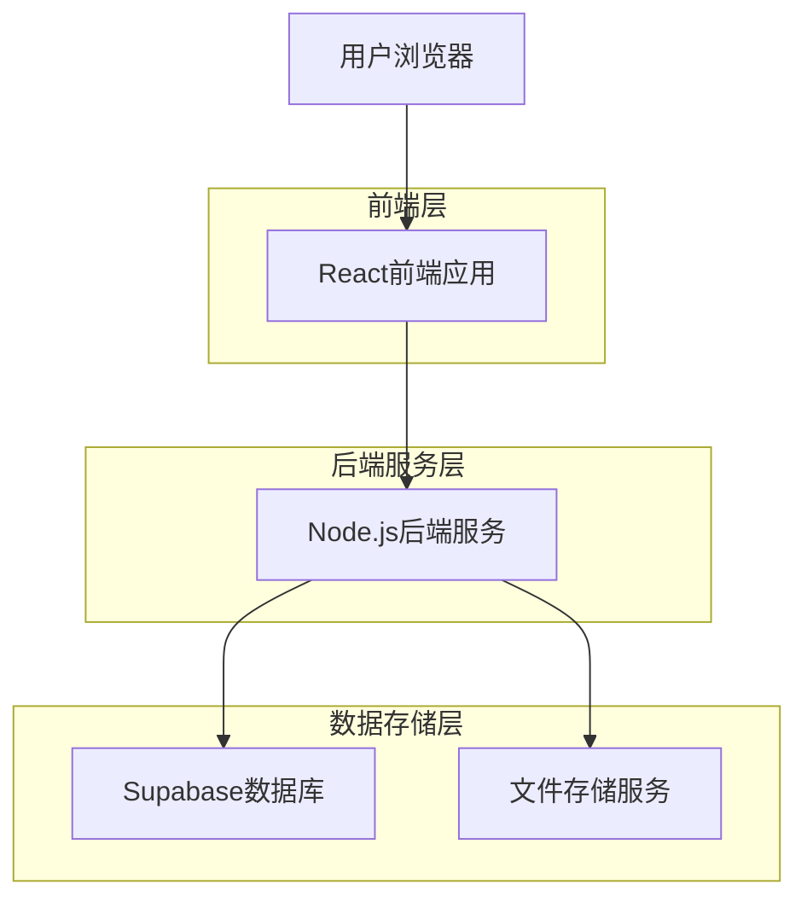
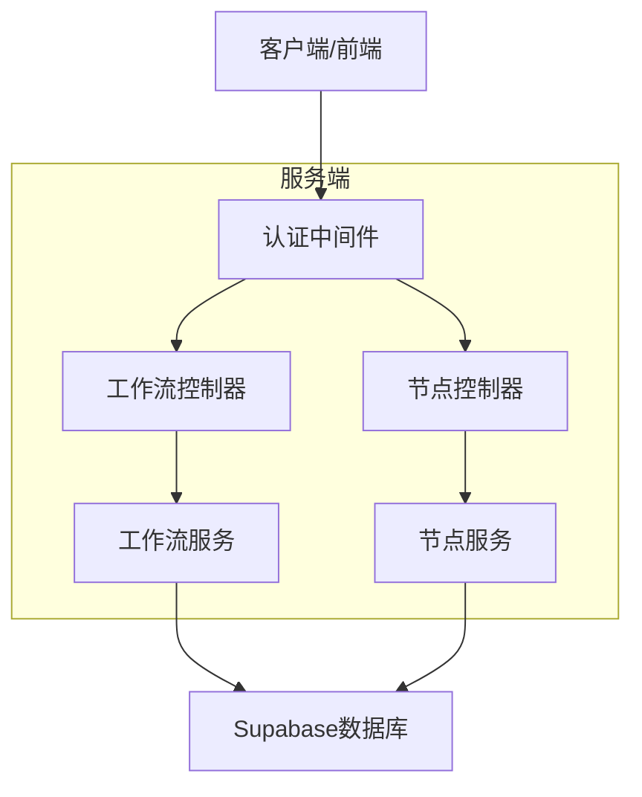
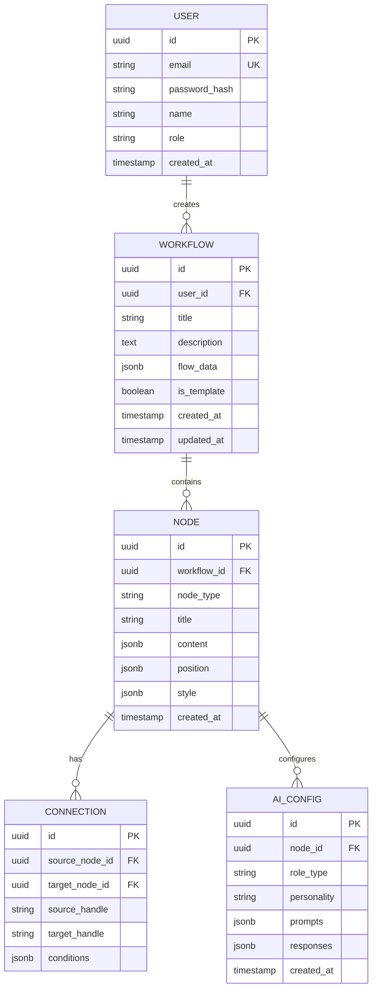

## 1. 架构设计



## 2. 技术栈描述

* **前端**：React\@18 + TailwindCSS\@3 + Vite

* **初始化工具**：vite-init

* **拖拽库**：React Flow\@11

* **后端**：Node.js\@18 + Express\@4

* **数据库**：Supabase（PostgreSQL）

* **部署平台**：Vercel

## 3. 路由定义

| 路由              | 用途              |
| --------------- | --------------- |
| /               | 登录页，用户身份验证      |
| /dashboard      | 工作流管理页，展示所有模板   |
| /editor/:id     | 工作流编辑页，可视化拖拽编辑器 |
| /config/:nodeId | 节点配置页，设置AI角色和属性 |
| /preview/:id    | 演练预览页，H5交互场景    |
| /result         | 演练结果页，展示练习结果    |

## 4. API定义

### 4.1 用户认证API

```
POST /api/auth/login
```

请求参数：

| 参数名      | 参数类型   | 是否必需 | 描述                |
| -------- | ------ | ---- | ----------------- |
| email    | string | 是    | 企业邮箱地址            |
| password | string | 是    | 登录密码              |
| role     | string | 是    | 用户角色（trainer/rep） |

响应参数：

| 参数名    | 参数类型   | 描述      |
| ------ | ------ | ------- |
| token  | string | JWT认证令牌 |
| userId | string | 用户唯一标识  |
| role   | string | 用户角色    |

### 4.2 工作流管理API

```
GET /api/workflows
POST /api/workflows
PUT /api/workflows/:id
DELETE /api/workflows/:id
GET /api/workflows/:id/export
```

### 4.3 节点配置API

```
GET /api/nodes/:id
PUT /api/nodes/:id
POST /api/nodes/ai-config
```

## 5. 服务端架构图



## 6. 数据模型

### 6.1 数据模型定义



### 6.2 数据定义语言

用户表（users）

```sql
-- 创建表
CREATE TABLE users (
    id UUID PRIMARY KEY DEFAULT gen_random_uuid(),
    email VARCHAR(255) UNIQUE NOT NULL,
    password_hash VARCHAR(255) NOT NULL,
    name VARCHAR(100) NOT NULL,
    role VARCHAR(20) NOT NULL CHECK (role IN ('trainer', 'rep')),
    created_at TIMESTAMP WITH TIME ZONE DEFAULT NOW()
);

-- 创建索引
CREATE INDEX idx_users_email ON users(email);
CREATE INDEX idx_users_role ON users(role);
```

工作流表（workflows）

```sql
-- 创建表
CREATE TABLE workflows (
    id UUID PRIMARY KEY DEFAULT gen_random_uuid(),
    user_id UUID REFERENCES users(id) ON DELETE CASCADE,
    title VARCHAR(200) NOT NULL,
    description TEXT,
    flow_data JSONB NOT NULL DEFAULT '{}',
    is_template BOOLEAN DEFAULT false,
    created_at TIMESTAMP WITH TIME ZONE DEFAULT NOW(),
    updated_at TIMESTAMP WITH TIME ZONE DEFAULT NOW()
);

-- 创建索引
CREATE INDEX idx_workflows_user_id ON workflows(user_id);
CREATE INDEX idx_workflows_template ON workflows(is_template);
```

节点表（nodes）

```sql
-- 创建表
CREATE TABLE nodes (
    id UUID PRIMARY KEY DEFAULT gen_random_uuid(),
    workflow_id UUID REFERENCES workflows(id) ON DELETE CASCADE,
    node_type VARCHAR(50) NOT NULL CHECK (node_type IN ('opening', 'info', 'objection', 'compliance')),
    title VARCHAR(200) NOT NULL,
    content JSONB NOT NULL DEFAULT '{}',
    position JSONB NOT NULL DEFAULT '{"x": 0, "y": 0}',
    style JSONB NOT NULL DEFAULT '{}',
    created_at TIMESTAMP WITH TIME ZONE DEFAULT NOW()
);

-- 创建索引
CREATE INDEX idx_nodes_workflow_id ON nodes(workflow_id);
CREATE INDEX idx_nodes_type ON nodes(node_type);
```

连接表（connections）

```sql
-- 创建表
CREATE TABLE connections (
    id UUID PRIMARY KEY DEFAULT gen_random_uuid(),
    source_node_id UUID REFERENCES nodes(id) ON DELETE CASCADE,
    target_node_id UUID REFERENCES nodes(id) ON DELETE CASCADE,
    source_handle VARCHAR(50),
    target_handle VARCHAR(50),
    conditions JSONB DEFAULT '{}',
    created_at TIMESTAMP WITH TIME ZONE DEFAULT NOW()
);

-- 创建索引
CREATE INDEX idx_connections_source ON connections(source_node_id);
CREATE INDEX idx_connections_target ON connections(target_node_id);
```

AI配置表（ai\_configs）

```sql
-- 创建表
CREATE TABLE ai_configs (
    id UUID PRIMARY KEY DEFAULT gen_random_uuid(),
    node_id UUID REFERENCES nodes(id) ON DELETE CASCADE,
    role_type VARCHAR(50) NOT NULL,
    personality TEXT,
    prompts JSONB DEFAULT '{}',
    responses JSONB DEFAULT '{}',
    created_at TIMESTAMP WITH TIME ZONE DEFAULT NOW()
);

-- 创建索引
CREATE INDEX idx_ai_configs_node_id ON ai_configs(node_id);

-- 权限设置
GRANT SELECT ON users TO anon;
GRANT ALL PRIVILEGES ON users TO authenticated;
GRANT SELECT ON workflows TO anon;
GRANT ALL PRIVILEGES ON workflows TO authenticated;
GRANT SELECT ON nodes TO anon;
GRANT ALL PRIVILEGES ON nodes TO authenticated;
GRANT SELECT ON connections TO anon;
GRANT ALL PRIVILEGES ON connections TO authenticated;
GRANT SELECT ON ai_configs TO anon;
GRANT ALL PRIVILEGES ON ai_configs TO authenticated;
```

## 7. 部署配置

* **前端构建**：Vite生产环境构建

* **后端部署**：Vercel Serverless Functions

* **数据库**：Supabase免费层配置

* **环境变量**：

  * `VITE_SUPABASE_URL`

  * `VITE_SUPABASE_ANON_KEY`

  * `SUPABASE_SERVICE_KEY`

  * `JWT_SECRET`

* **CI/CD**：GitHub Actions自动部署

